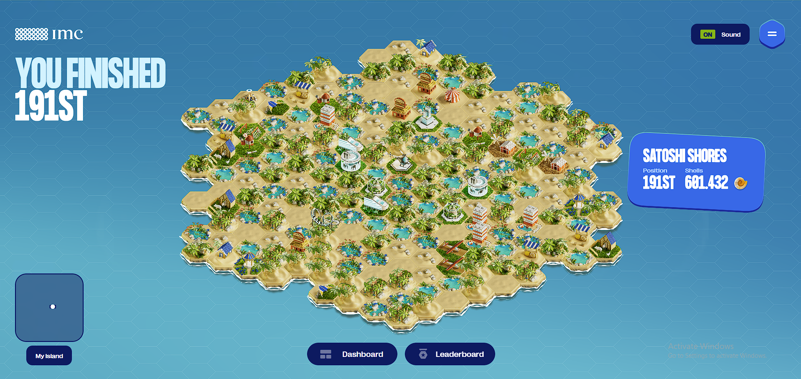
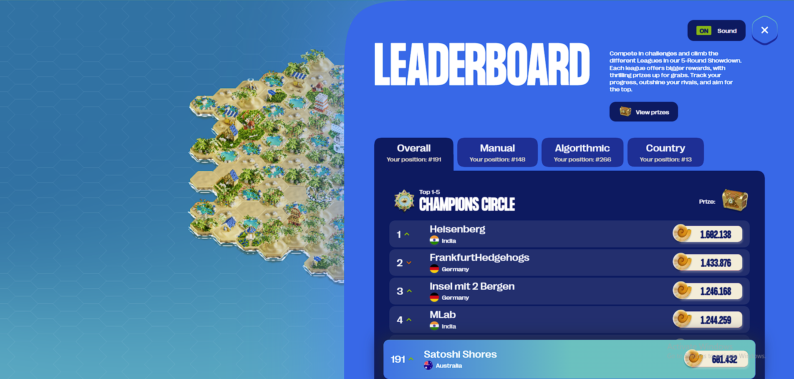

# 🏝️ Santoshi Shores — IMC Prosperity 3 Trading Competition

Welcome to **Santoshi Shores**, a tropical escape where high-frequency trading meets high-impact fun.  
We're a team of financial pirates, algorithmic explorers, and machine learning beach bums competing in the **IMC Prosperity 3** global trading challenge.

> _"In markets as in the ocean, the calm never lasts. Ride the waves, don't fight them."_

---

 

## 🧠 Who We Are

- **Team Name:** Santoshi Shores  
- **Competition:** [IMC Prosperity 3](https://prosperity.imc.com/)  
- **Focus:** Building robust, data-driven trading algorithms across various asset classes  
- **Vibe:** Equal parts *Wall Street* and *Moana*  

---

 

## 💡 What We Did

Our approach in the **IMC Prosperity 3** competition was centered around a blend of algorithmic trading strategies and advanced quantitative models to navigate the market’s ups and downs.

### 🔍 Key Strategies:
- **Arbitrage Trading:** Identifying price discrepancies between related assets for risk-free profit opportunities.  
- **Volatility Arbitrage:** Taking advantage of market inefficiencies in volatility predictions, paired with options pricing.  
- **Mean Reversion Algorithms:** Predicting market returns by identifying assets that have deviated from their historical mean, betting on a reversion.  
- **Options Trading & Delta Hedging:** Using the Black-Scholes model to price options, and implementing delta hedging strategies to mitigate risk and lock in profits.
 

### ⚙️ Advanced Techniques:
- **Traffic & Storage Cost Analysis:** We explored the impact of transaction costs, latency, and data storage, optimising strategies for low-latency execution and minimising operational expenses.  
- **Risk Management:** Implementing real-time adjustments to manage exposure, using techniques such as stop-loss orders and portfolio diversification.

We applied a range of **machine learning techniques** to optimise decision-making and improve the robustness of our trading models in different market conditions.

---

 

## 🛠️ Technologies Used

- **Languages:** Python, C++  
- **Libraries & Frameworks:** Pandas, NumPy, SciPy
- **Trading Models:** Black-Scholes, Mean Reversion, Volatility Arbitrage  
- **Data Analysis:** Time Series Analysis, Statistical Modeling  
- **Tools:** GitHub, Jupyter Notebooks, Matplotlib (for plotting PnL and performance metrics)  

---

 

## 🚀 Our Results

While the challenge itself had its ups and downs, our models demonstrated an ability to adapt quickly to changing market conditions. We saw success in some strategies — and gained deep insights into **advanced trading strategies** and **algorithm optimisation**.

🏁 In the final round, we surged ahead by **100 positions**, finishing **191st overall** out of **12,620 teams worldwide**. Within Australia, we proudly ranked **13th**, placing us in the **top 1.5% globally** — an achievement that reflects our team's persistence, adaptability, and collaborative problem-solving.

